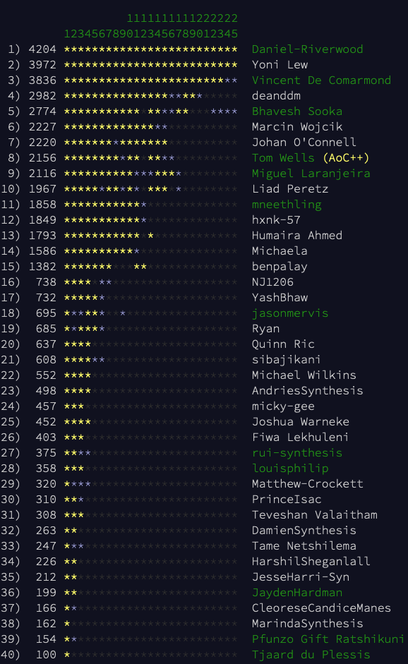
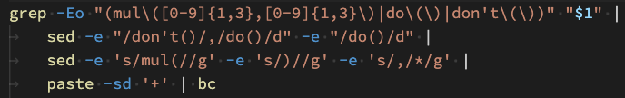
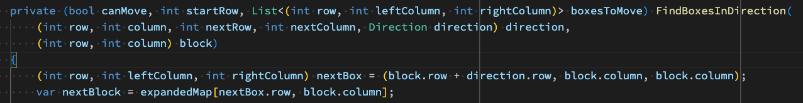
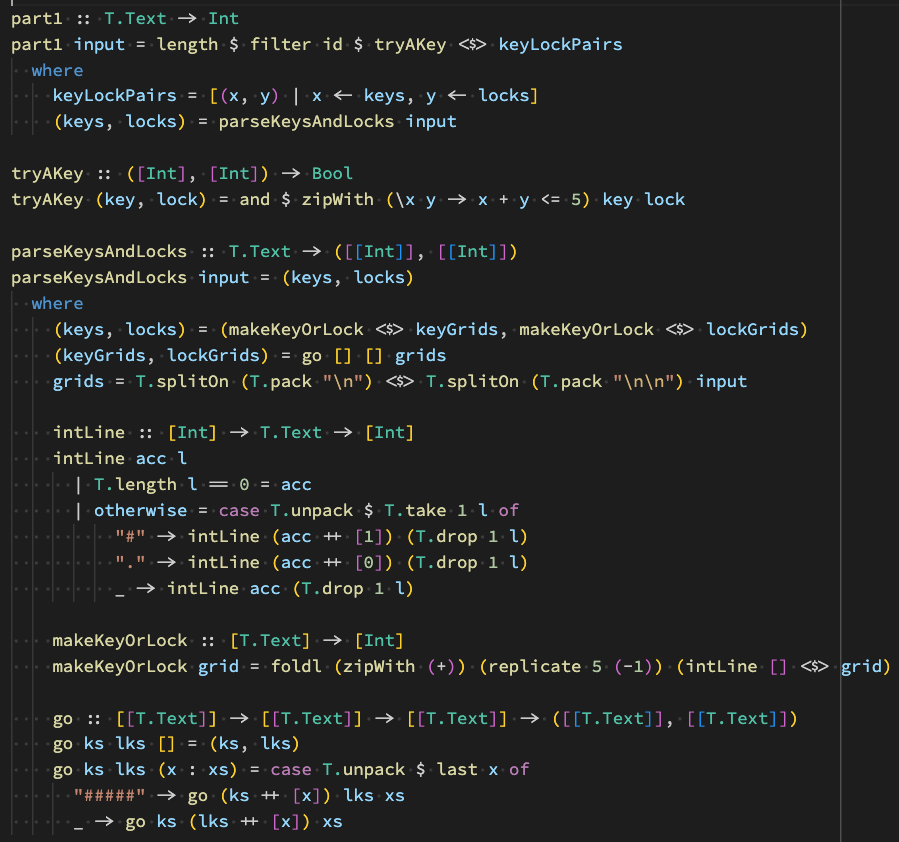
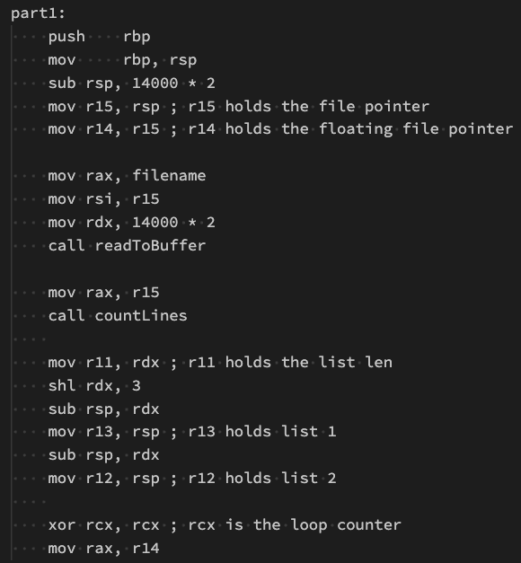
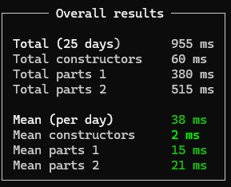

# Advent of Code 2024 Solutions

:rocket: Presented by Labs Team :rocket:

# What to do
1. Signup for Advent of Code [here](https://adventofcode.com) (using your github account is best)
1. Join our Labs leaderboard [here](https://adventofcode.com/2024/leaderboard/private/view/2306561) (use join code - 2306561-242f2386)
1. Join the Labs' AoC discord [here](https://discord.gg/8P9j29Gb)
1. If you would like to share your solutions please feel free to create yourself a folder (maybe with your name, e.g. "tom") and push

Any issues please reach out to Mike, Tom, Tjaard, Bhavesh, Marais, or Francois. for help!

PS Some of last years' solutions [here](https://github.com/synthesis-labs/AoC_2022) and [here](https://github.com/synthesis-labs/AoC_2023) 

# The Challenge laid down!

Tjaard sent the following email:

    Howzit tech wizards!

    PROFESSIONAL SERVICES IS OFFICIALLY CHALLENGING PRODUCTS TO AN ADVENT OF CODE SHOWDOWN.

    It’s brains versus… well, also brains!

    Not in Professional Services or Products? No problem! If your tech skills are legendary, pick a side—maybe base your loyalty on which exec is the sexiest (obvious choice, right?).

    The stakes? The losing exec (me or MickeyG) takes an icy plunge into Cape Town’s freezing waters. 🥶

    We’ll simply sum up all participants’ points to determine the winner! Worried about team size differences? Don’t stress, I’ve got just enough math skills to work out something fair.

    Bonus challenge: Use a functional programming language, score the most points, and I'll treat you to lunch with me, which is probably a punishment. Fine, I'll throw in a Takealot voucher to sweeten the deal. We can chat about coding. I'll be brave and share my "work-in-progress" (read: epic failure) functional programming GitHub repo for you to laugh at. At least it’s packed with great functional programming resources to get you started!

    Winner announcement: January.

    Game on! 🚀

And Tom followed up with:

    Hello Code Adventers!!
    
    🔥 TECHNOLOGY is cranking up the heat! 🔥
    
    To celebrate this epic battle between Professional Services & Product – I am adding a few extra prizes to the pot to raise the stakes and ignite even more participation!
    
    The Thing of Beauty – for the cleanest and most elegant solution that makes our jaws drop
    The Absolute Pits – for the most criminally insane solution that defies logic, but somehow works?
    Eye of the Beholder – for the most idiomatic solution capturing the spirit of the language chosen
    The Rube Goldberg – for that solution that simply had to show off
    
    I’ll be checking the github repo linked below for code so make sure you check-in often. Winners will receive Takealot vouchers and will be announced along with Tjaard’s challenge below!
    
    Let the games begin :) 🚀

# The Results

We had an amazing response, which included approximately 40 people taking part:

Plus a whole lot of code committed to this repository across a bunch of different languages and approaches.

## Cluster Challenge: Products Cluster vs Professional Services Cluster

Hi, Tjaard here. Early signs shows professional services has won! (But MickeyGee needs to review when he gets back)

I summed and averaged to get to the following calcs:

| Cluster               | People in Cluster | Participants | Total Score | Average Score |
|-----------------------|-------------------|--------------|-------------|---------------|
| Professional Services | 129               | 25           | 34621       | 1384          |
| Products              | 67                | 12           | 7415        | 618           |
| Other / Unknown       |                   | 3            | 4737        |               |

This was a manual exercise to piece together current employee allocations, and it isn't perfect. But I tried to be fair, I promise 😉

## Functional language bonus

Our two top functional language solvers were:

- **Vincent**, who used LISP. I'd count this as functional, especially given its prominent use in the legendary MIT book, Structure and Interpretation of Computer Programs. (A must-read for any programmer!)
- **Bhavesh**, who used Haskell, a purely functional programming language. It's designed to enforce functional principles like immutability and first-class functions, making it a shining example of functional programming.

I might just treat both of them... who knows!

## Award 1: *The Thing of Beauty*

"for the cleanest and most elegant solution that makes our jaws drop"

This one was an absolute jawdropper no doubt and just ridiculously good. Its so good that once you see this approach its hard to see any other solution (assuming you choose regex as a parser - which most people probably did!). Fantasticly good!

Well done VINCENT 🚀🚀🚀 !!!

## Award 2: *The Absolute Pits* 

"for the most criminally insane solution that defies logic, but somehow works?"

Day 15 (the horible one with the robot that pushes the boxes around) was a killer for most people, and we had some sterling attempts to solving this one with various levels of success. One thing is for sure, almost nobody was proud of what they produced solving this one. However one solution stood out for me, and included a bunch of beautiful methods written in over 300 lines of C# with names such as `ExpandTheMap`, `MoveTheRobot` and `MoveTheRobotExpanded`. However the real stunner was this eye-watering method signature that immediately stood out:

Well done to DEAN 🚀🚀🚀 for taking the prize, and for producing code that I know you were loath to checkin!! (But also well done for hanging in there and solving this really tough one)

## Award 3: *Eye of the Beholder*

"for the most idiomatic solution capturing the spirit of the language chosen"

For someone who has really just started learning Haskell and stuck with it (almost) throughout the entire challenge, this solution is pretty darn impressive. Nothing too fancy, but very idiomatic and just nice to look at. Also the shortest day 25 solution between all those survived the challenge, showing off that Haskell can be very expressive and compact in the hands of a skilled programmer!

Well done BHAVESH 🚀🚀🚀!!

## Award 4: *The Rube Goldberg*

"for that solution that simply had to show off"

Boy oh boy oh boy oh boy. I fell off my chair. FELL. When I saw this one get checked in. It must be a joke? Surely?

Nope. Not a joke. 

This solution takes the Rube Goldberg award after solving day 1 in ONLY 340 lines of ASSEMBLER! Sure it was the easiest day, but it was DAMN impressive and the winner gave up submitting any further solutions directly after so it must have really killed his spirit. 

So even though it was a drive-by submission and we didn't see you again, DAMIEN 🚀🚀🚀 - you legend, take this prize for leaving your mark!!

## The Ultimate Winner

We didn't have a category for this, but holy moly there is one guy who absolutely smoked this challenge, day after day after day after day. This guy pretty much grabbed the first gold star every single day, and usually had the solution before most people rolled out of bed in the morning. 

Is he an AI? No! He is FRANCOIS 🚀🚀🚀 (but yes he might be a robot!). Not only did he solve every problem, he also optimized each solution to have them all run in less than 1 second in total (yes all 50 solutions in under 1 second - proof below).

Well done everyone! What a stellar event!